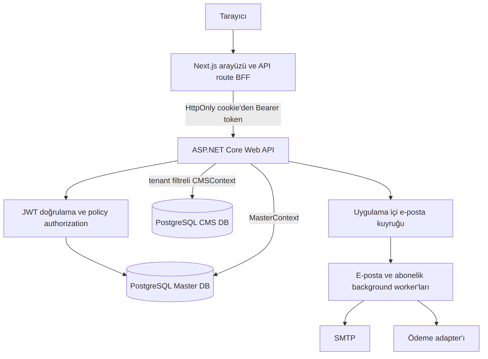
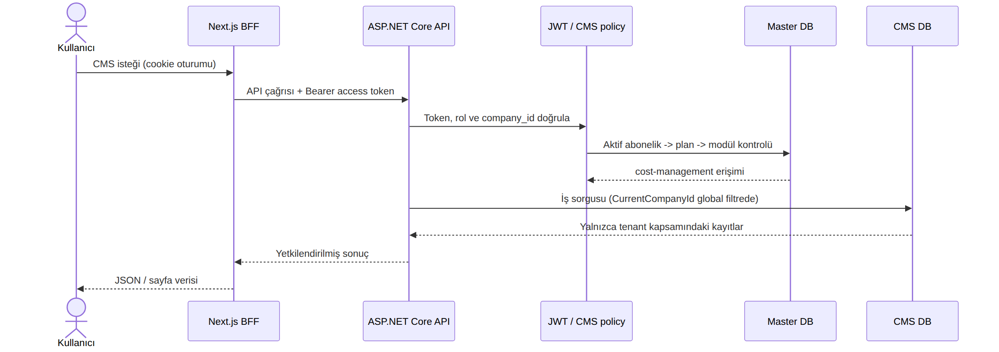
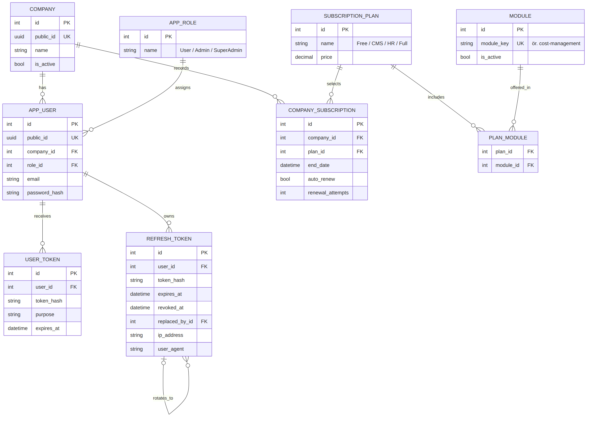
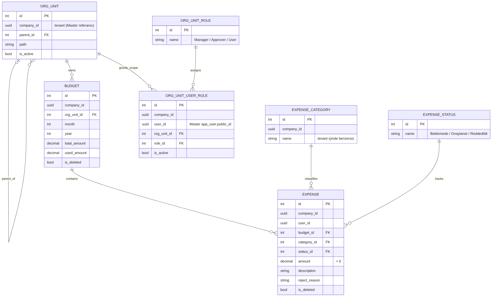

## Mimari ve Veri Modeli

> Uygulama tek bir ASP.NET Core API içinde modüler monolit olarak çalışır; Next.js tarafındaki API route'ları BFF/proxy görevi görür.

### 1. Sistem Bileşenleri



### 2. İstek Akışı (Kimlik doğrulama → abonelik/modül kontrolü → tenant filtreli sorgu)



### 3. Master DB (Kimlik, şirket, abonelik, modül kataloğu)



### 4. CMS DB (Bütçe ve masraf yönetimi)



> Not: Master ve CMS ayrı PostgreSQL veritabanlarıdır. CMS tarafındaki `company_id` ve `user_id`, Master'daki kaydın public UUID değerini taşıyan mantıksal referanslardır (veritabanları arası FK yoktur).

## Sistemi Ayağa Kaldırmak

### 1. .NET 10 SDK

.NET 10 SDK'yı indirin: https://dotnet.microsoft.com/en-us/download/dotnet/10.0

### 2. Uygulamayı Klonlama

`git clone https://github.com/Lightarasohn/SaaS.git` komutu ile uygulamayı klonlayın.

### 3. Secrets

Proje .NET Secrets yerine appsettings.json kullanmakta. Projedeki appsettings.json yapısı:
```
{
  "Logging": {
    "LogLevel": {
      "Default": "Information",
      "Microsoft.AspNetCore": "Warning"
    }
  },
  "AllowedHosts": "*",
  "FrontendBaseUrl": "<FrontendBaseUrl>",
  "ConnectionStrings": {
    "MasterConnection": "<MasterDBConnectionString>",
    "CMSConnection": "<CMSDBConnectionString>"
  },
  "EmailSettings": {
    "SystemName": "<GoogleName>",
    "SystemEmail": "<SystemEmail>",
    "AppPassword": "<GoogleAppPassword>",
    "SmtpServer": "smtp.gmail.com",
    "SmtpPort": 587
  },
  "JwtSettings": {
  "Issuer": "<Issuer>",
  "Audience": "<Audience>",
  "SigningKey": "<SigningKey>", 
  "AccessTokenMinutes": <minutes>,
  "RefreshTokenDays": <days>
  },
  "CRUDSettings": {
    "MaxCreateRange": 50,
    "MaxUpdateRange": 100
  }
}
```
Kod bloğundaki "<>" ile belirlenmiş bölümlere kendi ayarlarınızı yazmanız gerekmektedir.

> Not: Ben projedeki e-posta servisi için google smtp sunucusunu kullandım.

### 3. Çalıştırma

Sırasıyla:
- `dotnet restore`
- `dotnet build`
- Build başarılı olduğunda `dotnet run`

komutları ile uygulamayı ayağa kaldırabilirsiniz.
